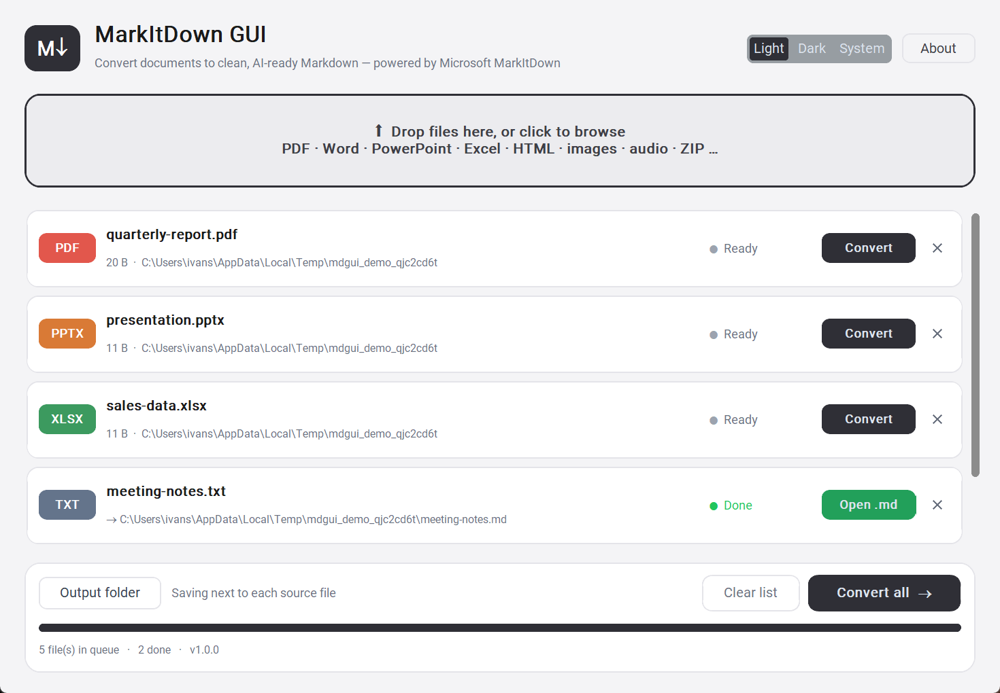

# MarkItDown GUI

> A modern, cross-platform desktop GUI for [Microsoft MarkItDown](https://github.com/microsoft/markitdown) — drop in your documents and get clean, **AI-ready Markdown** back.


LLMs read Markdown far better than raw PDFs or Office files. MarkItDown GUI puts a friendly face on Microsoft's MarkItDown converter: add any number of files, hit **Convert** on a single file or **Convert all**, and `.md` files appear next to your sources (or in a folder of your choice).



## Features

- 🖱️ **Drag & drop** or browse — add many files at once (folders are scanned recursively)
- ⚡ **Per-file or batch conversion** with live status, progress bar and error reporting
- 📁 **Output control** — save `.md` next to each source, or pick one output folder
- 🌗 **Light / Dark / System** theme (light by default) with a clean, modern design (CustomTkinter)
- 🔔 **Update check** — the app tells you when a new release is out (About → *Check for updates*); nothing is downloaded automatically
- 🧵 Conversions run in **background threads** — the UI never freezes
- 🔓 100 % local & offline — your documents never leave your machine (the only network call is the optional version check against GitHub)

### Supported formats

PDF · Word (`.docx`) · PowerPoint (`.pptx`) · Excel (`.xlsx`, `.xls`) · CSV/TSV · JSON · XML · HTML · TXT/MD · Jupyter (`.ipynb`) · EPUB · Outlook (`.msg`, `.eml`) · ZIP archives · images (`.jpg`, `.png`, `.gif`, `.webp`) · audio (`.mp3`, `.wav`, `.m4a`)

## Installation

### Windows

Download `MarkItDownGUI-Setup.exe` from the [setup folder](https://github.com/ivansostarko/markitdown-gui/blob/main/setup/windows/MarkItDownGUI-Setup_1.0.0.exe) and run it.

### Linux

**Debian / Ubuntu (.deb):**

```bash
sudo apt install ./markitdown-gui_1.0.0_amd64.deb
```

**Any distro (tarball):**

```bash
tar -xzf markitdown-gui-1.0.0-linux-x86_64.tar.gz
./markitdown-gui/markitdown-gui
```

### From source (all platforms)

```bash
git clone https://github.com/ivansostarko/markitdown-gui.git
cd markitdown-gui
python -m venv .venv
# Windows: .venv\Scripts\activate     Linux/macOS: source .venv/bin/activate
pip install -e .
markitdown-gui
```

> **Linux note:** Tkinter must be available — `sudo apt install python3-tk` on Debian/Ubuntu.

## Building the installers yourself

### Windows installer (`.exe`)

Requires [Inno Setup 6](https://jrsoftware.org/isinfo.php) on `PATH` (optional — without it you still get the portable app in `dist/`).

```bat
scripts\build_windows.bat
```

Produces `dist/MarkItDownGUI/` (portable) and `installers/windows/Output/MarkItDownGUI-Setup.exe`.

### Linux packages (`.deb` + tarball)

```bash
./scripts/build_linux.sh
```

Produces `dist/markitdown-gui_<version>_amd64.deb` and `dist/markitdown-gui-<version>-linux-x86_64.tar.gz`.

Both are also built automatically by [GitHub Actions](.github/workflows/build.yml) on every tagged release (`git tag v1.0.0 && git push --tags`).

## How it works

The GUI is a thin layer over the `markitdown` Python package:

```
src/markitdown_gui/
├── app.py        # CustomTkinter window, file queue, threading
└── converter.py  # MarkItDown wrapper: convert_file(), supported extensions
```

Each conversion calls `MarkItDown().convert(path)` in a worker thread (max 2 in parallel) and writes `result.text_content` to `<name>.md` (UTF-8, LF line endings). Re-converting a file overwrites its previous `.md`.

## Development

```bash
pip install -e ".[dev]"
ruff check src tests   # lint
pytest                 # tests (skipped automatically if markitdown isn't installed)
```

## Contributing

Pull requests are welcome! See [CONTRIBUTING.md](CONTRIBUTING.md).

## License

[MIT](LICENSE) — not affiliated with Microsoft. MarkItDown is © Microsoft, also MIT-licensed.
